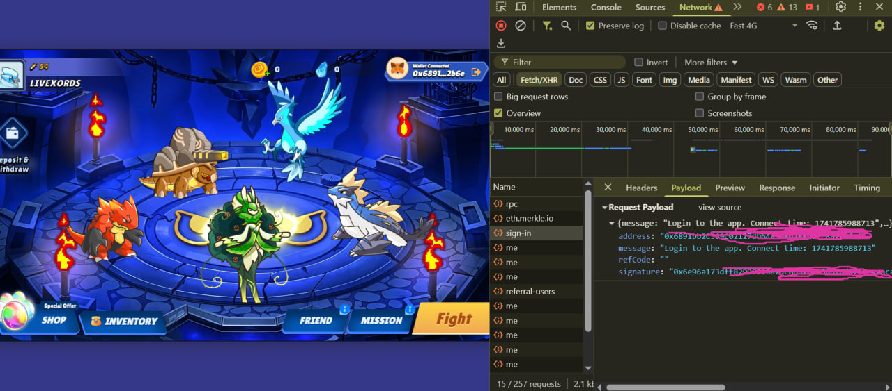

---

<h1 align="center">Monster Kombat Bot</h1>

<p align="center">Automate tasks in Monster Kombat to enhance your efficiency and maximize your results!</p>

---

## 🚀 **About the Bot**

The Monster Kombat Bot is designed to automate various tasks in **Monster Kombat**, including:

- **Auto Task:** Automatically solving tasks 🤖
- **Auto Fight:** Engage in epic battles automatically! ⚔️🔥🏆  
  _(This feature also integrates auto upgrade pet functionality for improved performance.)_

With this bot, you can save time and maximize your outcomes without manual intervention.

---

## 🌟 Version v1.0.0

### Updates

- **Initial Release:**  
  Welcome to the initial release of Monster Kombat Bot. This version brings you the core automation features along with multi-account and proxy support to optimize your gameplay.

### Future Updates

1. **Auto Buy Egg (Shop):**  
   An automatic egg purchasing system will be added to the shop for a smoother gameplay experience.
2. **Fight System Optimization:**  
   Further optimizations will be made to the fight system to improve battle performance.
3. **Combine System:**  
   A combine system will be introduced, allowing you to merge items or monsters for enhanced abilities.

---

### **Features in This Version:**

- **Auto Task:** Automatically solve tasks 🤖
- **Auto Fight:** Automatically engage in battles (includes auto upgrade pet) ⚔️🔥🏆
- **Multi-Account Support:** Manage multiple accounts simultaneously.
- **Proxy Support:** Dynamically assign proxies to different accounts.
- **Delay Loop and Account Switching:** Set custom delays for looping tasks and switching between accounts.

---

## ⚙️ **Configuration in `config.json`**

Below is the configuration table for the Monster Kombat Bot:

| **Function**           | **Description**                             | **Default** |
| ---------------------- | ------------------------------------------- | ----------- |
| `task`                 | Automatically solving tasks                 | `true`      |
| `fight`                | Auto Fight (includes auto upgrade pet)      | `true`      |
| `delay_account_switch` | Delay between account switches (in seconds) | `10`        |
| `delay_loop`           | Delay before the next loop (in seconds)     | `3000`      |

And here is a sample `config.json`:

```json
{
  "fight": true,
  "task": true,
  "delay_account_switch": 10,
  "delay_loop": 3000
}
```

---

## 📖 **Installation Steps**

1. **Clone the Repository**  
   Copy the project to your local machine:

   ```bash
   git clone https://github.com/livexords-nw/monsterkombat-bot.git
   ```

2. **Navigate to the Project Folder**  
   Move to the project directory:

   ```bash
   cd monsterkombat-bot
   ```

3. **Install Dependencies**  
   Install the required libraries:

   ```bash
   pip install -r requirements.txt
   ```

4. **Configure Query**  
   Create a `query.txt` file and add your Monster Kombat query data.  
   **Query format:**

   ```
   signature|address|timestamp
   ```

   **How to obtain your query:**  
   You can find this query by inspecting the website. Open your browser's Developer Tools, navigate to the **Network** tab, log in, and look for an API call named **sign-in**. Then, check its payload to copy the required query information.

   

5. **Set Up Proxy (Optional)**  
   To use a proxy, create a `proxy.txt` file and add proxies in the following format:

   ```
   http://username:password@ip:port
   ```

   - Only HTTP and HTTPS proxies are supported.

6. **Run the Bot**  
   Execute the bot using the following command:

   ```bash
   python main.py
   ```

---

## 📥 **How to Register**

Start using Monster Kombat Bot by registering through the following link:

<div align="center">
  <a href="https://game.monsterkombat.io/?ref=Y7zsu4qH" target="_blank">
    
  </a>
</div>

---

## 🛠️ **Contributing**

This project is developed by **Livexords**. If you have suggestions, questions, or would like to contribute, feel free to contact us:

<div align="center">
  <a href="https://t.me/livexordsscript" target="_blank">
    
  </a>
</div>
